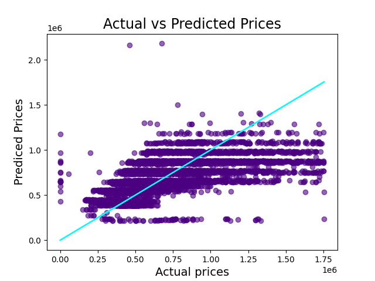
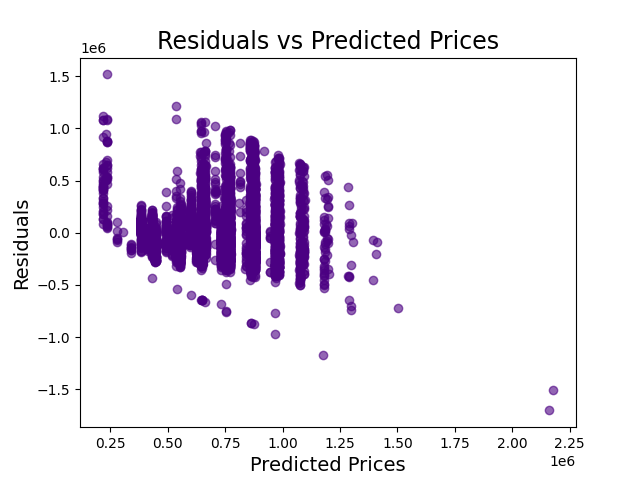
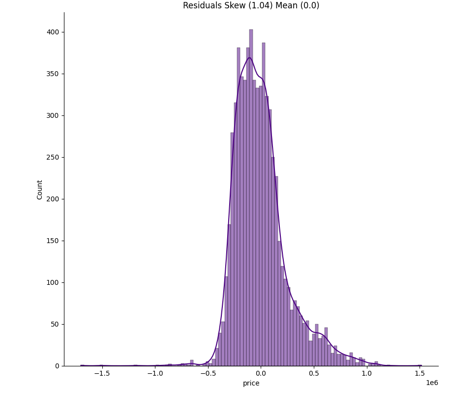
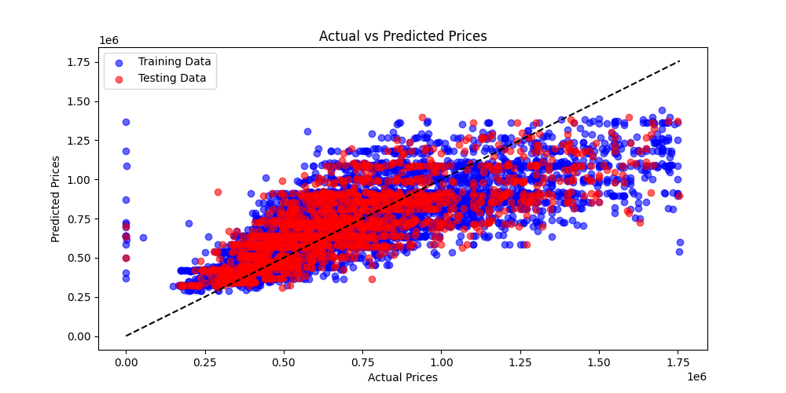
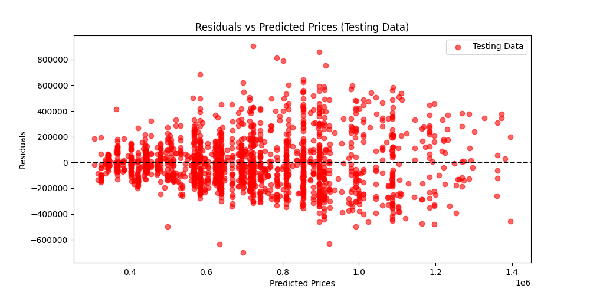

# House Price Prediction Report

## Introduction
This report provides an overview of the house price prediction models in price_estimator and some example plots to illustrate features.

The dataset includes the number of beds, baths, parking spaces, crime score (a numerical value assigned by AFP by suburb based on weighted combinations of different crime types), and education score (simply given by the predicted 2024 ATAR for the closest school to each house). 

The dataset is still under construction, with suburbs added one at a time to limit load on the domain.com website. Only the most recent 800 to 1000 house sales are included for each suburb, so the dates are all relatively new, no time variable has been used.

Outliers based on z-score > 3 have been removed to aid in model training. This is conducted BEFORE any of this visualisation work.

## Data overview
Price distribution is centred around $500,000 but heavily skewed toward higher prices up to $1.7 million.

The heat distribution and scatter plots highlight suburbs which have been added already, highlighting a lack of data in the north of canberra as suburbs have been added at random.

## Linear Regression model
Actual vs predicted prices are clearly unable to account for expensive (> $1.2 million) homes, and overall show a poor model fit.

This is empahsised by a clear residuals grouping in one corner of the plot, with systematic lines due to the discrete and small nature of the data (rooms, beds, parking have few available values.)

The residuals have a skew of 1.04 as expected for lack of high price homes accuracy.

The r-square of 0.36 solidifies the assumtion that this is a poor model. However it should be noted that these are drastically improved since the addition of suburb data. Skew and correlation were even worse before.

The log model performed even more poorly, with a skew of -12.7 and an r-squared of 0.29.

## Gradient boosted model
The gbr model is far better performing overall.

Actual vs predicted priced clearly correlate, and although the higher price homes fall below the regression model, it is less prominent than before.

The residuals show relatively good spread considering the binning of small value integers is still present.

The r-squared is up to 0.58, and the residuals skew is 

Feature importances:
features.beds       0.479417
edu_score           0.227399
features.baths      0.168554
crime_score         0.085250
features.parking    0.039379

## Conclusion
The model demonstrates poor predictive performance overall, but is impressive for the limited number of data points provided for each house. As always, data is king, and more is more!